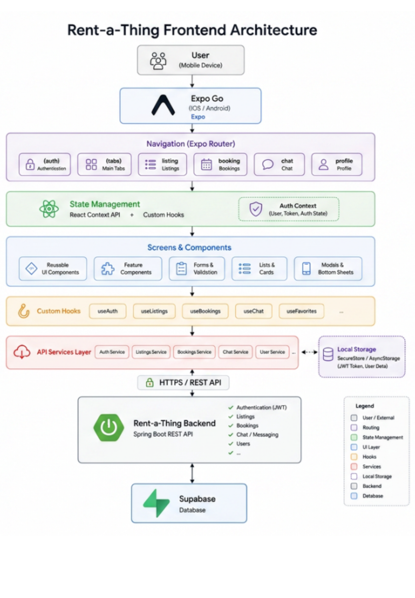

## Architecture


# Rent-a-Thing Frontend

A cross-platform mobile application built with Expo and React Native for the Rent-a-Thing rental marketplace.

Users can browse listings, create rental offers, manage bookings, communicate through chat, and manage their profiles directly from their mobile devices.

## Features

* User Authentication & Registration
* Email Verification
* Browse Available Listings
* Create and Manage Listings
* Image Upload Support
* Booking Management
* Real-Time Messaging
* Favorites System
* User Profile Management
* Responsive Mobile UI

The application follows a feature-based architecture:

```text
Screens
   ↓
Components
   ↓
Hooks / State Management
   ↓
API Services
   ↓
Spring Boot Backend
```

## Tech Stack

### Mobile Framework

* React Native
* Expo Go
* TypeScript

### Navigation

* Expo Router

### State Management

* React Context API
* Custom Hooks

### Networking

* Fetch API / Axios

### UI

* React Native
* Expo Components

### Backend Communication

* REST API
* JWT Authentication

## Getting Started

### Prerequisites

* Node.js 18+
* npm
* Expo Go installed on your mobile device

### Installation

```bash
git clone <https://github.com/DavidKlobucaric/Rent_a_Thing1.git>
cd frontend
npm install
```

### Environment Variables

Create a `.env` file in the project root:

```env
EXPO_PUBLIC_API_BASE_URL=http://YOUR_BACKEND_IP:8080
```

### Start Development Server

```bash
npx expo start
```

Then:

1. Open the Expo Go app on your phone.
2. Scan the QR code displayed in the terminal/browser.
3. The application will launch on your device.

## Backend

This application communicates with the Rent-a-Thing Spring Boot backend through REST APIs secured using JWT authentication.

Backend repository:

```text
Rent-a-Thing Backend: <https://github.com/DomiBeljo/Rent-a-Thing-Git.git>
```

## Future Improvements

* Push Notifications
* In-App Payments
* Advanced Search Filters
* Offline Support
* WebSocket-Based Real-Time Chat